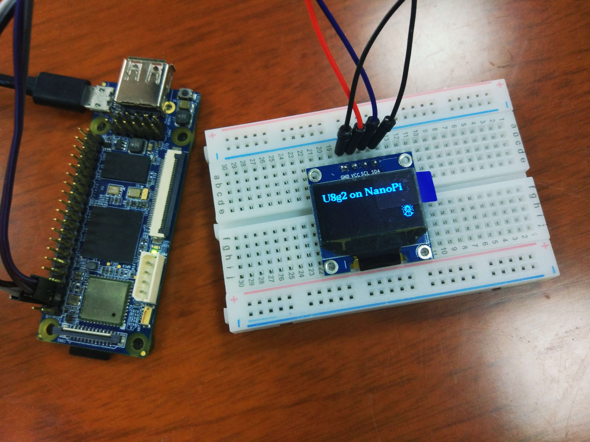
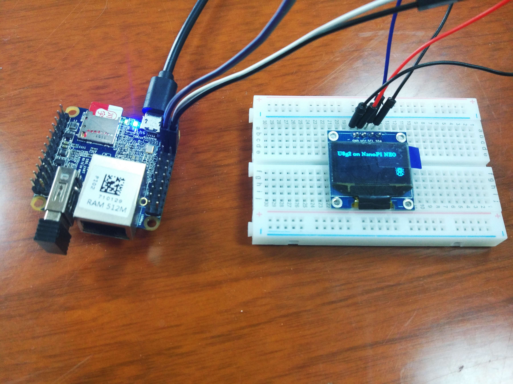
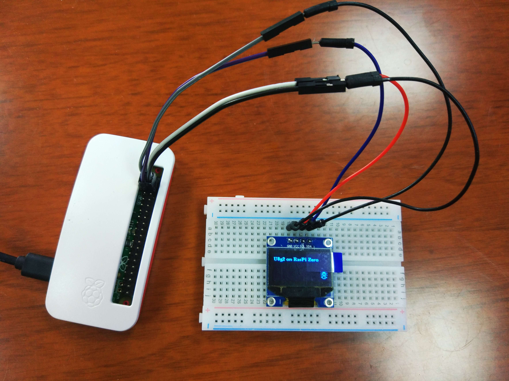
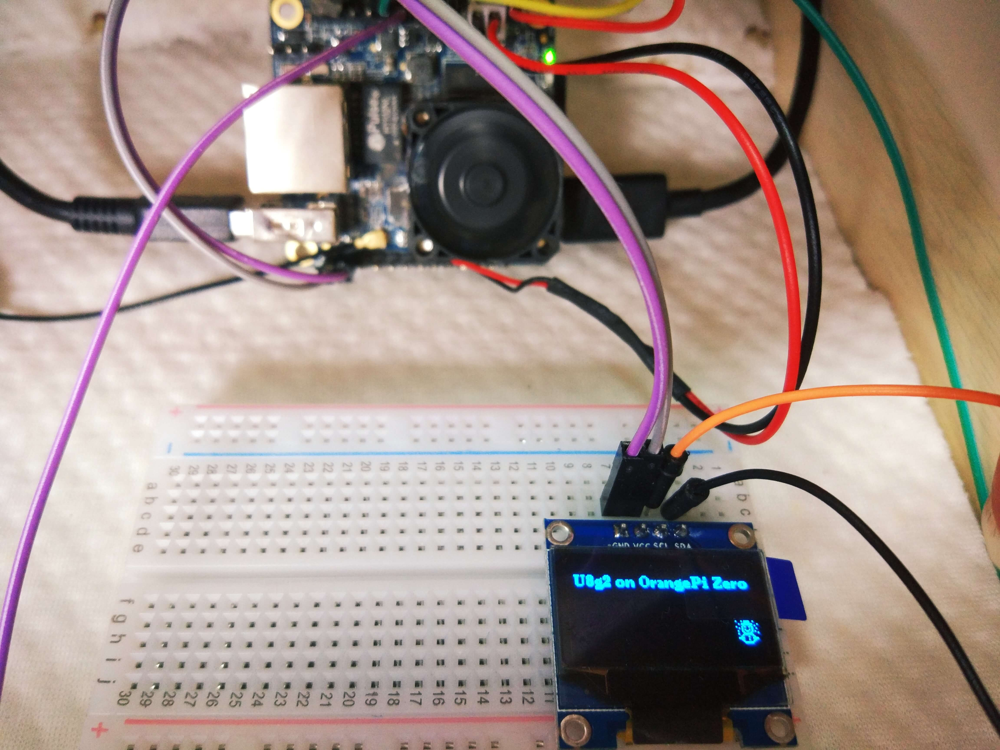
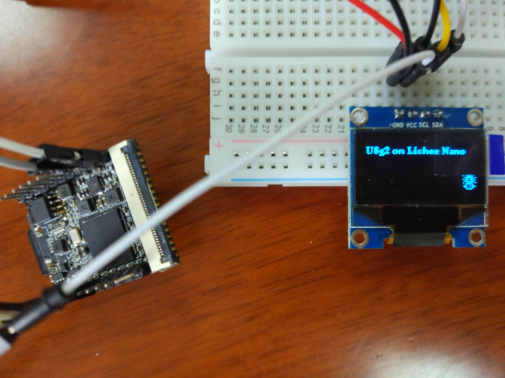

# U8g2 for arm-linux

## Intro

U8g2 is a monochrome graphics library for embedded devices, and I ported it onto arm linux.

It should work fine on virtually all devices running linux with i2c support, since no libraries pertaining to specific platforms has been used, yet you need to choose right compilers for your devices. 

## Todo

- [●] Hardware I2C
- [&nbsp;&nbsp;] Hardware SPI
- [&nbsp;&nbsp;] Software I2C
- [&nbsp;&nbsp;] Software SPI
- [&nbsp;&nbsp;] GPIO & Delay

## Gallery 

Nanopi  
[http://wiki.friendlyarm.com/wiki/index.php/NanoPi](http://wiki.friendlyarm.com/wiki/index.php/NanoPi)  

	

Nanopi NEO  
[http://wiki.friendlyarm.com/wiki/index.php/NanoPi_NEO](http://wiki.friendlyarm.com/wiki/index.php/NanoPi_NEO)  

	

Raspberry Pi ZERO  
[https://www.raspberrypi.org/products/raspberry-pi-zero/](https://www.raspberrypi.org/products/raspberry-pi-zero/)  

	

Raspberry Pi 2 B+  
[https://www.raspberrypi.org/products/raspberry-pi-2-model-b/](https://www.raspberrypi.org/products/raspberry-pi-2-model-b/)  

	

Orange Pi ZERO  
[http://www.orangepi.org/orangepizero/](http://www.orangepi.org/orangepizero/)  

	

Lichee Pi NANO  
[http://nano.lichee.pro/](http://nano.lichee.pro/)  

	

## How to compile

First, clone this repo:  

`$ git clone https://github.com/wuhanstudio/u8g2-arm-linux.git`

`$ cd u8g2-arm-linux`

Change cross-compiler in Makefile according to your board.

	# Chosse proper compiler for your PI
	# NanoPi:             arm-none-linux-gnueabi-gcc
	# Raspberry Pi Zero:  arm-none-linux-gnueabi-gcc

	# Raspberry Pi 2:     arm-none-linux-gnueabihf-gcc
	# OrangePi Zero:      arm-none-linux-gnueabihf-gcc
	# NanoPi NEO:         arm-none-linux-gnueabihf-gcc
	# NanoPi NEO Plus 2:  arm-none-linux-gnueabihf-gcc
	CC = arm-none-linux-gnueabihf-gcc

For cross-compile:

	arm-none-linux-gnueabi-gcc   for armv6  
	arm-none-linux-gnueabihf-gcc for armv7

For native-compile (compile on your board), simply use:
	
	CC = gcc

Finally, time to compile:

`$ make`

## How to run

Before running, you can check your I2C graphic devices using i2c-tools: 

`$ sudo apt-get install i2c-tools`  

List your devices:

`$ ls /dev/i2c*`  
`/dev/i2c-0  /dev/i2c-1`

Probe your devices on bus 0:

`$ i2cdetect -y -r 0`

-----

For cross-compile, you can change ip address in Makefile:

	# IP Address of your PI	
	PI=pi@10.1.1.232

Then upload generated binary file onto your board:

`$ make upload`

For native-compile:

`$ sudo ./i2c-oled`

## Limitations

As for now, only I2C part has bee ported.
 

I'll make an implementation for SPI controller in the future.

## Related Projects

- U8g2: https://github.com/olikraus/u8g2
- U8glib: https://github.com/olikraus/u8glib